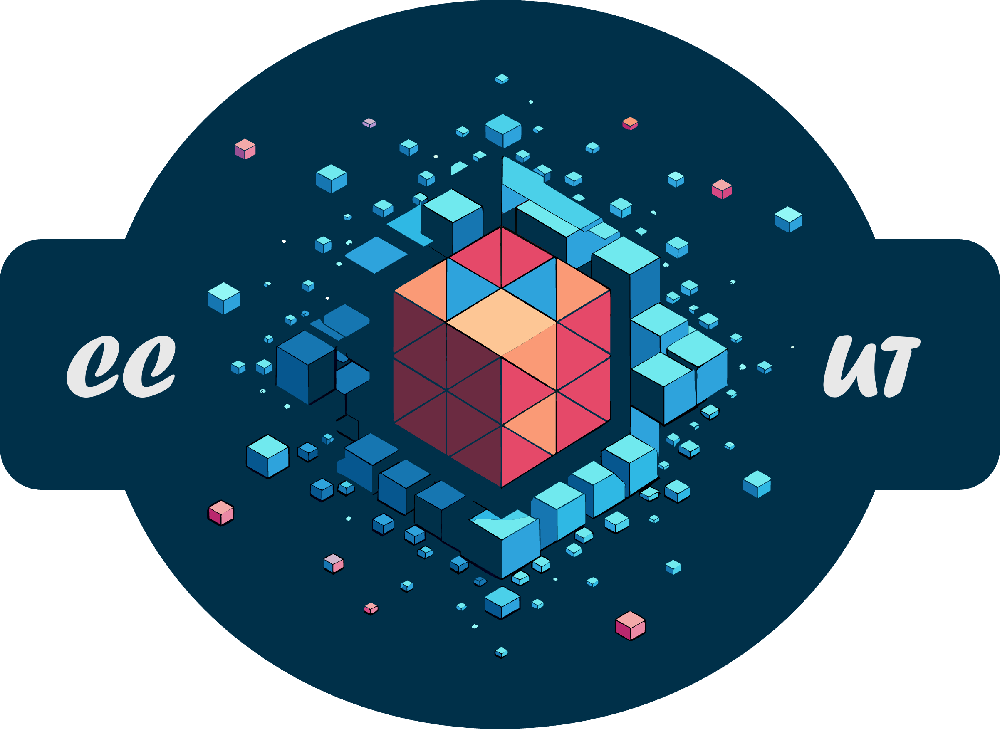
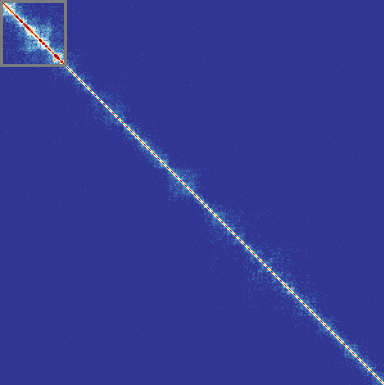

<p align="center">
  
</p>


### Welcome to CCUT - the Chromatin Conformation Capture Upsampling Toolbox

#### TLDR
To get started, clone the repo and create a conda environment based on the env.yml file:
##### Install locally from git:

```bash
git clone https://github.com/stasys-hub/CCUT.git
cd CCUT 
mamba env create -f env.yml
mamba activate ccut
coverage run -m pytest -v
```

##### Install in container from git using docker (you need docker installed):

```bash
git clone https://github.com/stasys-hub/CCUT.git
cd CCUT 
sudo docker build --file Dockerfile_mamba --tag ccut-mamba:9428586418 .
sudo docker run --rm -it -v </home/user/local_dir>:</mnt/data> ccut-mamba:9428586418 /bin/bash
```

> [!TIP]
> We recommend using mamba as a drop in replacement for conda: [Miniforge](https://github.com/conda-forge/miniforge#mambaforge).

> [!NOTE]
> If you want to change the environment name which is by default set to 'ccut' you should change it in env.yml: `name: ccut`
> This will also be the environment name you have to specify while using conda/mamba -> e.g.: `mamba acivate your-env-name`

> In the docker installation you will need to mount a local folder containing you data into container using the `-v` flag
#### Post Install
After Installation you should see a folder structure similar to this:
```.
└── CCUT
    │ 
    ├── ccut
    │   ├── data_prep
    │   ├── nn
    │   ├── tests
    │   └── utils
    └── data
```
- `data_prep` contains scripts to create sample list and downsample cooler and pairs files, if you want to create your own training sets 
- `nn` is the heart of ccut and contains all things related to models
    - prebuilt models
    - the basemodel class if you want to plugin your model
    - layers -> contains prebuilt blocks to build your own model
    - hooks for the trainer class, to give more control over training 
    - losses predefined custom losses
    - and the trainer class   
- `utils` contains modelus to transform, visualize and load data as the `CC_Dataset Class`
- you will also find the `main_train.py` file there, which contains some examples to run training 
##### Download a pretrained model and testdata here:
We will update models here: [Model-Archive](https://seafile.rlp.net/d/69f7c94f87d04757b2e4/)

[Test-Data](https://seafile.rlp.net/d/920559eb35d34b1c917b/)
#### Rstoration
<p align="center">
  
</p>

##### Loading a pretrained model
Please have a look at the tutorials: ccut/Tutorial-inference.ipynb & ccut/Tutorial-training.ipynb.
We provide pretrained models for our efficient UNetRRDB network. If you want to load a pre-trained model infer the type and data trained on from the naming-scheme:
< modeltype>-<params>-<cctype>-<fator>-<loss>
for example: unet-1024-patchsize-porec-4x-tvloss.pth
``` python
#import the model
import torch
import cooler
import numpy as np
from nn.rrdbunet import UNetRRDB2

# Load a model
unet = UNetRRDB2(in_channels=1, out_channels=1, features=[64, 128, 256, 512, 1024])
unet.load('./checkpoints/unet-1024-50x50-porec-4x-tvloss.pth')

# Load a cooler to enhance
clr = cooler.Cooler('4DN.mcool::/resolutions/50000')

# predicet and upsampled chrom
chr19 = unet.predict(clr = clr, gcoor = 'chr19', resolution = 50_000, patch_size = 50, percentile_cutoff = 73)


np.save('./chrom19.npy', chr19)

```

##### Using Predefined Training Blocks
##### Using the Trainier Class
Before you use the Trainer class some things have to be prepared. The most important thing is to have your coolers in place and have a list of ccordinates which will be used for training. You can generate such lists using the `create_sliding_window_coor.v2.py` utility as for example here:
> [!TIP]
> Use the `--help` flag to get some info on the parameters
```bash
python create_sliding_window_coor.v2.py --cooler_file /home/muadip/Data/Pairs/SRR11589414_1_v2.mcool::/resolutions/20000 --output_path chr19-22_40x40x20k --resolution 50000 --window_size 40 --chromosome chr19,chr20,chr21,chr22
```

If you want to train based on coolers that's all you need, despite setting a path to your low and high res coolers in a data.json file (example in ccut/data). If you want to use numpy matrices as input you have to use the Numpy_Dataset class and prepare the matrices with 'convert_and_normalize_v3.py' as for example here:
```bash
python convert_and_normalize_v3.py SRR11589414_1_4x_v2.mcool::/resolutions/50000 --prefix <filename_prefix> --output_path <your/outpudir/> --processes 9 --chromosomes 1-18  --cutoff 73 --norm
```
> [!NOTE]
> We recommend to work with min-max normalized data, since the models tend to learn with such data more effectively. To transform your data back to counts after training, one has just to multiply with the cutoff value or the max frequency if no cutoff was applied. If you wish to nor notrmalize leave out the `--norm` flag. We recommend using a cutoff of the 99.9th percentile of the dataset, which is about 71 for pore-C and 314 for Micro-C from Krietenstein et al.


##### Using Hooks


##### How to cite

DOI: [10.1101/2024.05.29.596528](https://doi.org/10.1101/2024.05.29.596528)
If you use this tool in your work, we would be really happy if you cite us:
```
@article{Sys2024,
  title = {CCUT: A Versatile and Standardized Framework to Train 3C Deep Restoration Models},
  url = {http://dx.doi.org/10.1101/2024.05.29.596528},
  DOI = {10.1101/2024.05.29.596528},
  publisher = {Cold Spring Harbor Laboratory},
  author = {Sys,  Stanislav Jur ’Evic and Ceron-Noriega,  Alejandro and Kerber,  Anne and Weissbach,  Stephan and Schweiger,  Susann and Wand,  Michael and Everschor-Sitte,  Karin and Gerber,  Susanne},
  year = {2024},
  month = jun 
}
```

