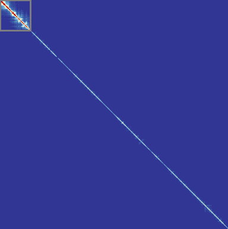
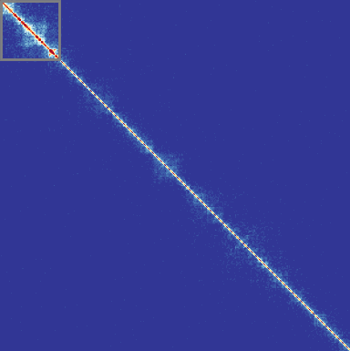

<p align="center">
  
</p>

### xcut — Hi-C Contact Matrix Enhancement Toolkit

xcut is a deep learning toolkit for enhancing low-resolution Hi-C / Micro-C / Pore-C contact matrices. It trains neural network models (HINet-GAN, Rectified Flow, PMRF) to restore high-resolution chromatin contact maps from downsampled or sparse input data.

<div align="center">

| Micro-C 16x @ 10k | Pore-C 4x @ 50k |
| ----------------- | ---------------- |
|  |  |

</div>

#### Installation

```bash
git clone https://github.com/stasys-hub/CCUT.git
cd CCUT
uv sync
```

#### Preprocessing: Nonzero-Percentile Clipping

Standard whole-matrix percentile clipping includes zeros in the calculation, causing the threshold to collapse to near-zero for sparse data like Pore-C (>95% zeros) and destroying the near-diagonal high-count signal that encodes TADs and loops. Our nonzero-percentile clipping restricts the calculation to observed contacts only, preserving the natural dynamic range regardless of sparsity — enabled via `nonzero_percentile: true` in the config or `--nonzero` on the CLI. All normalization is per-chromosome for consistent scaling and trivial inversion to counts at inference.

**Built-in transform pipelines** (shorthands for YAML config):

| Shorthand | Transforms | Use case |
|-----------|-----------|----------|
| `log1p_99.99` | HandleNan → ClipLogByPercentile(99.99) → EnsureFloat32 | General-purpose, default |
| `log1p_99.95` | HandleNan → ClipLogByPercentile(99.95) → EnsureFloat32 | Sparse data (Pore-C) |
| `minmax_99.95` | HandleNan → ClipByPercentile(99.95) → DivideByMax(99.95) → EnsureFloat32 | Linear normalization |
| `log1p_none` | HandleNan → LogTransform(scale_by_max=True) → EnsureFloat32 | No clipping, full dynamic range |

Custom pipelines can be specified as an explicit list of transforms with parameters — see `configs/hinet_gan_4x.yaml` for an example.

#### CLI Usage

> [!TIP]
> Use `xcut <command> --help` for detailed parameter info on any command.

```bash
# Train from a YAML config
xcut train configs/hinet_gan_4x.yaml
xcut train configs/hinet_gan_4x.yaml --device cuda:1 --set train.lr=3e-4

# Enhance a low-resolution cooler
xcut enhance data/lr.cool --checkpoint runs/my_run/best_model.pth --hr-cooler data/hr.cool

# Downsample a cooler (Binomial subsampling)
xcut downsample data/sample.cool -r 16 --resolution 50000

# Apply transforms to a cooler
xcut transform data/hr.cool --clip 99.95 --nonzero

# Visualize a genomic region
xcut viz data/sample.cool -c chr1 -s 0 -e 5000000 --resolution 50000

# Compare two coolers side by side
xcut compare data/lr.cool data/hr.cool -c chr1 -s 0 -e 5000000
```

#### Python API

```python
from xcut.data import CoolerDataset, WindowConfig, get_log1p_pipeline
from xcut.config import RunConfig
from xcut.training import train_from_config

# Config-driven training
cfg = RunConfig.load("configs/hinet_gan_4x.yaml")
train_from_config(cfg)

# Or use the data pipeline directly
transforms = get_log1p_pipeline(percentile=99.99)
dataset = CoolerDataset(
    window_config=WindowConfig(window_size=64, resolution=50000, step=0.5),
    lr_cooler_path="data/lr.mcool::/resolutions/50000",
    hr_cooler_path="data/hr.mcool::/resolutions/50000",
    transforms=transforms,
    chrom_range=range(1, 19),
)
```

#### Project Structure

```
xcut/
├── __init__.py          # Public API
├── cli.py               # Click CLI (train, enhance, transform, downsample, viz, compare)
├── config.py            # Pydantic config models (RunConfig, DataConfig, etc.)
├── registry.py          # Model registry (hinet, hinet_gan, rectified_flow)
├── training.py          # Config-driven training loop
├── inference.py         # Inference + Hann-window stitching → cooler
├── metrics.py           # SSIM, PSNR, MSE, MAE (NumPy + PyTorch)
├── data/
│   ├── coordinates.py   # CoordinateGenerator + WindowConfig + per-chrom stats
│   ├── datasets.py      # CoolerDataset, SingleCoolerDataset, etc.
│   ├── transforms.py    # 12 composable transforms
│   └── preprocessing.py # Binomial downsampling, cooler creation, P(s) curves
└── models/
    ├── hinet.py         # HINet generator (~88M params)
    ├── hinet_gan.py     # Discriminator + WGAN-GP training loop
    ├── hinet_i2sb.py    # HINet with timestep conditioning
    ├── rectified_flow.py # Rectified Flow diffusion
    ├── pmrf.py          # Posterior-Mean Rectified Flow
    └── losses.py        # Structure, insulation, distance decay losses
```

#### Example Configs

| Config | Description |
|--------|-------------|
| `hinet_gan_4x.yaml` | HINet-GAN, 4x downsampled, 50kb, clip+minmax |
| `ablation_log.yaml` | HINet-GAN, 4x, log1p normalization |
| `human_16x_50k_64px.yaml` | HINet-GAN, 16x, 50kb, log1p+nonzero percentiles |
| `celegans_16x_50k_32px.yaml` | C. elegans, 16x, 50kb, 32px patches |
| `test_run.yaml` | Quick test config (2 epochs, C. elegans data) |

#### How to Cite

Stanislav Sys, Marcel Misak, Azza Soliman, Rosa Herrera-Rodriguez, Ruxandra-Andreea Lambuta, Stephan Weißbach, Michael Wand, Karin Everschor-Sitte, Susann Schweiger, Jasper J. Michels, Jan Padeken, Susanne Gerber. *Correcting Preprocessing Bias in Sparse Chromatin Contact Data Enables Physically Interpretable Reconstruction of Genome Architecture.* Submitted, 2026.
